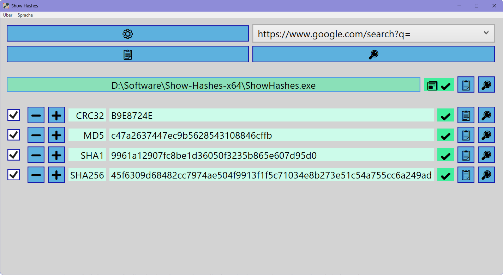

# ShowHashes

## What

Show Hashes is a program to quickly view a file’s hash values.

## Why

I created Show Hashes because I wanted a fast and easy way to check, search, and copy file hashes directly from the Windows context menu.

## Features

- **Supported hash methods**: CRC32, MD5, SHA1, SHA256.
- **Copy to clipboard**: Copy individual hashes or all enabled hashes at once.
- **Browser search**: Search for individual or multiple hashes using your preferred search engine (Google, Bing, DuckDuckGo, Yandex).
- **Selection control**: Enable, disable, or individually select which hashes you want to use via whitelisting, blacklisting, or manual selection.
- **Include method name**: Optionally include the hash method (e.g., "MD5") when copying or searching.
- **Custom prefix**: Optionally set a custom prefix before the hash value when copying or searching.
- **Multilingual Support**: English, Español, Deutsch, Português, Français, Italiano, 日本語, 한국어, 中文, हिन्दी, Русский.
- **Portable**: No installation required, place the executable anywhere and run it.
- **Context Menu Integration**: Show Hashes can be added to the Windows context menu by running the [registry tool script](https://github.com/FelipeRT98/ShowHashes/blob/main/ShowHashes-registry-tools.bat).

## Build

Show Hashes is a Windows Presentation Foundation application which requires [.NET 8.0](https://dotnet.microsoft.com/en-us/download/dotnet/8.0).

To build the application for different architectures, use the following commands:
- **64 bit**: `dotnet publish -c Release -r win-x64 -p:PublishSingleFile=true --self-contained false`
- **32 bit**: `dotnet publish -c Release -r win-x86 -p:PublishSingleFile=true --self-contained false`
- **ARM**:    `dotnet publish -c Release -r win-arm64 -p:PublishSingleFile=true --self-contained false`

---

